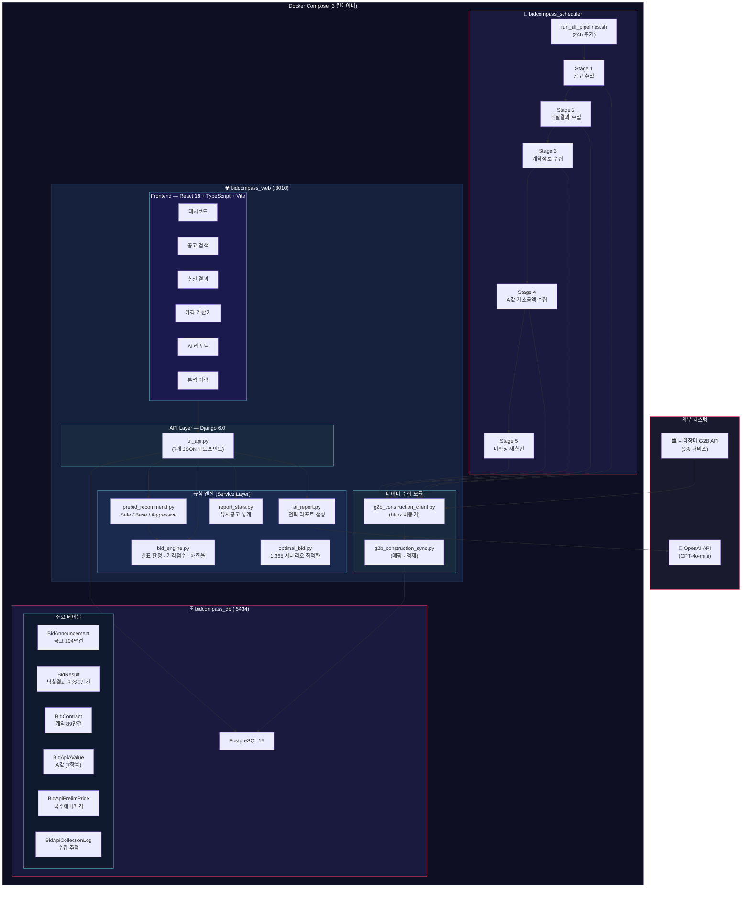
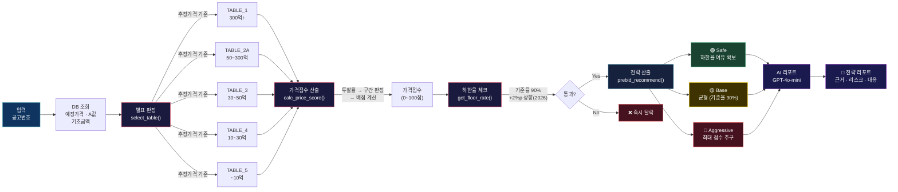
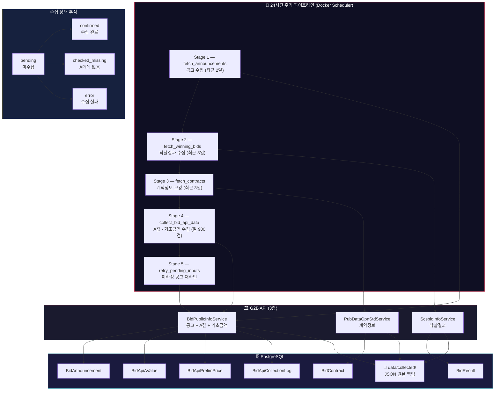
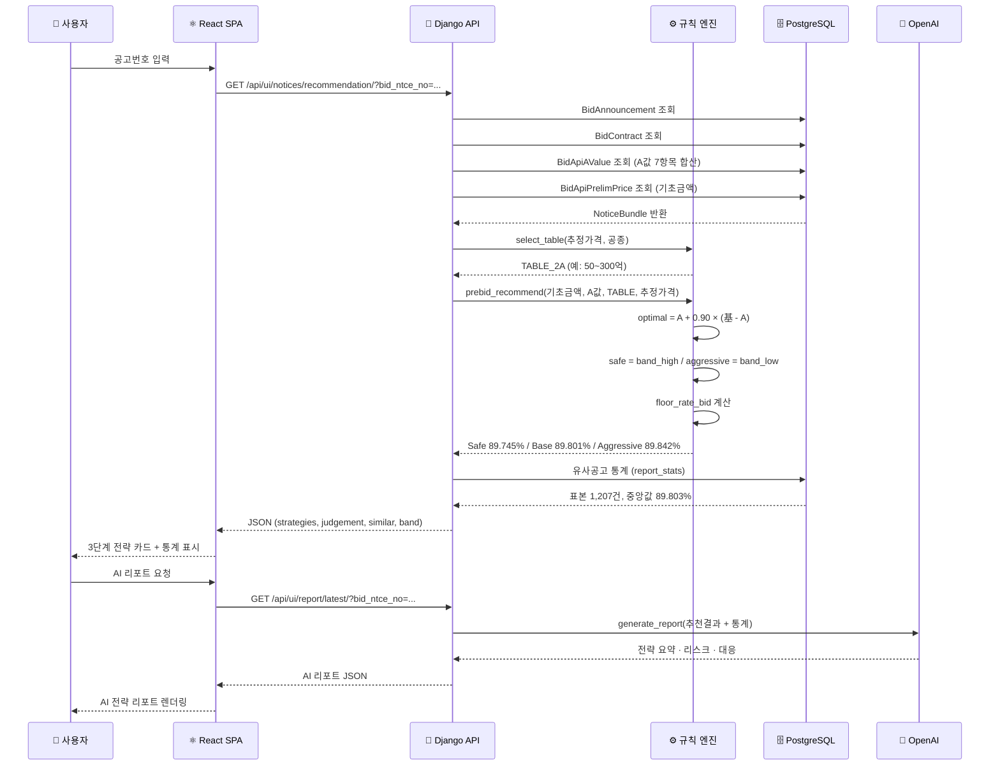

# BidCompass 시스템 아키텍처

## 1. 전체 시스템 구성도

## 2. 규칙 엔진 상세 흐름

## 3. 데이터 수집 파이프라인

## 4. 사용자 요청 흐름 (추천 API)

## 5. 기술 스택 요약

| 계층 | 기술 | 용도 |
|------|------|------|
| **Frontend** | React 18 + TypeScript + Vite | SPA, 다크테마 UI |
| **Backend** | Django 6.0 + Python 3.10 | API, 규칙 엔진 |
| **Database** | PostgreSQL 15 | 공고/낙찰/계약 데이터 |
| **AI** | OpenAI GPT-4o-mini | 전략 리포트 생성 |
| **외부 API** | G2B 나라장터 API 3종 | 공공조달 데이터 수집 |
| **배포** | Docker Compose (3 컨테이너) | db + web + scheduler |
| **패키지** | uv (pyproject.toml) | Python 의존성 관리 |
| **정밀연산** | Decimal (ROUND_HALF_UP) | 1원 단위 정확도 |
| **테스트** | 184개 자동화 테스트 | 35 클래스, 전 계층 검증 |
